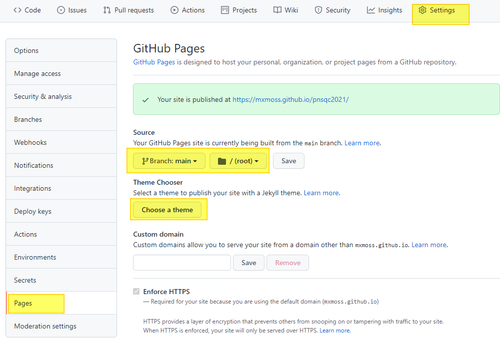

# Prerequisites

## 1) Install the git client on your local computer.

Go here: <https://git-scm.com/book/en/v2/Getting-Started-Installing-Git>

Install the precompiled Git tools for your operating system

### a) For Windows 
  <https://git-scm.com/download/win>
  
### b) For Linux

    sudo dnf install git-all
  
### c) For MacOS
  run git from the Terminal the very first time.

    $ git --version

  if that doesn't work 
  <https://git-scm.com/download/mac>

Choose all the defaults...

Except: Choose whatever editor is most comfortable for you 

## 2) Sign up for a github account

Sign up here on github: <https://github.com/signup?source=login>

Use a real email address, so you can get the email confirmations & launch code

Follow the instructions for signing up 

Suggested signup choices:
- Just me
- Student
- Collborative coding 
- Automation and CI/CD
- Security 
- Project Management 
- Community
- "Continue for free" 

You can play with the hello world repo project if you want 
<https://guides.github.com/activities/hello-world/>

# Exercises

## Ex. 1) Fork the workshop Repo from my account on Github 

Go here:
<https://github.com/mxmoss/pnsqc2021>

Click on the [Fork] button

Explore the fork of the project in your repo 

## Ex. 2) Clone the project locally

### a) Open a terminal to use the git command line

To start a Command Prompt or PowerShell in Windows:

    [ctrl]+[Esc] | Cmd | [enter]

To open a terminal in macOS:

    [Command]+[Space] | Terminal.app | [Enter]

From the command prompt, type 'git' and press return to verify that git is installed

### b) Clone the project onto your computer

    git clone https://github.com/<yourgithub>/pnsqc2021.git  

where <yourgithub> is your github account name.

eg: my account name is mxmoss.

    git clone https://github.com/mxmoss/pnsqc2021.git 

You should see something like:

    Cloning into 'pnsqc2021'...
    remote: Enumerating objects: 4, done.
    remote: Counting objects: 100% (4/4), done.
    remote: Compressing objects: 100% (3/3), done.
    remote: Total 4 (delta 0), reused 0 (delta 0), pack-reused 0
    Unpacking objects: 100% (4/4), done.
    Checking connectivity... done.

### c) Verify that the files are local

View the files in the directory

    dir pnsqc2021 

Move to the directory with the repo

    cd pnsqc2021

Try some git commands:

    git (with no parameters) 
    git help -g
    git help -a
    git status 
    git show head
    git config 

Set configuration if necessary. Do this only if user.email or user.name are empty

To check:

    git config --global user.email
    git config --global user.name
	
To set: 

    git config --global user.email "you@example.com"
    git config --global user.name "Your Name"
  
While we're talking about configuration, let's create a Personal Access Token (PAT)

In the upper-right corner of any github page, make sure you're signed in to github. Then click your profile photo. 
From the menu choose:

Settings | Developer Settings | Personal access tokens 

Type in "pnsqc 2021 token" for the description
	
Set the checkbox for "repo"
	
Treat this token like a password.

## Ex. 3) Add a new feature to the project
	
### a) Practice Branching
	
From the git command line, find out your status

    git status

You may also use the branch command to show which branch you are in
	
    git branch 
	
Create a branch called "feature-1" and switch to that branch
	
    git checkout -b feature-1
	
Switch between branches
	
    git checkout main
    git checkout feature-1

Let's delete the feature-1 branch

    git checkout main
    git branch -D feature-1   (deletes the branch new-feature)
	
Now, let's make a branch for you to work on

    git checkout -b myfeat1

### b) Make changes and commit them
Create the file "myfeature.txt". Depending on your operating system there are different ways to edit a text file. Here are a couple examples:
### Windows: 

    notepad myfeature.txt  
### Linux: 

    vim myfeature.txt
or
	
    nano myfeature.txt 
### MacOS: 

    vim myfeature.txt 
Type in some text.  For example, you can add your name and answer these questions:
- What did I learn from the workshop?
- Did I have any un-met expectations?

Save and exit editor

Verify that you have created the new file 

    git status

Add the untracked file to the repo

    git add myfeature.txt 
	
Alternatively, add _all_untracked files 

    git add .

Commit the changes to the local repo 

    git commit -m "initial commit for myfeature.txt. my first commit"

Push the changes to the remote repo

    git push -u origin myfeat1

You may need to enter your github username

Enter the previously generated token (PAT) in the password field.

## Ex. 4) Pull requests
In this exercise we handle a pull request to our repository, then issue a pull request to an upstream repository

### a) Handle the pull request created in exercise 3.
In github, see the notification "Compare & pull request"
Click the button to compare. You will see a message whether the changes can be merged automatically.
This would be the point to integrate either manual or automatic code reviews.
Enter a reason for OK'ing the change and merge the pull request.
	
### b) Create a pull request for the upstream repo
This is a request from you to me.  You are asking me to integrate the changes you have done in your repo, into my own repo.
You have already forked my repo https://github.com/mxmoss/pnsqc2021 and in your fork it shows https://github.com/<yourusername>/pnsqc2021 (see exercise 3).
In your repo, click on the [Contribute] to initiate a pull request with me.

Github will show the changes across the two repositories. Click on [Create pull request] to notify me that you have a change.

	
Git a description of why you're creating the pull request. This includes the title - think of it as a headline to a newspaper article.  Then provide the concise reason why.

Github will check for merge conflicts and then send the pull request to the owner of the upstream repo.

	
Upstream in my repository, I will see pull requests.

	
At this point, the owner of the upstream repo can respond appropriately. 
Maybe they will close the pull request with a comment, which means it won't be merged.
Or, perhaps they will see the benefit of your change and just merge it.
Most likely, however, the owner will have further questions and this is a chance for a conversation about the best path forward.

## Ex. 5) Github pages 
Publish your repository on Github Pages so it's public to the world

To configure the repo to publish the main branch, choose 
- Settings 
- Click on the "pages" tab on left-hand side of the page 
- Choose the branch to publish, and click Save 

Alternatively, you may wish to use a Jekyll theme to enhance the markdown page. 
In this case you will need to choose a markdown pre-processor.

## Links 
- [GitHub](http://github.com)
- [GitHub Cheat Sheet](https://github.com/tiimgreen/github-cheat-sheet)
- [Awesome Lists](https://github.com/sindresorhus/awesome)
- [Generating an access token](https://docs.github.com/en/github/authenticating-to-github/keeping-your-account-and-data-secure/creating-a-personal-access-token)
- [How to use access tokens](https://github.blog/2020-12-15-token-authentication-requirements-for-git-operations)
- [using OAuth tokens for github automation](https://docs.github.com/en/github/extending-github/git-automation-with-oauth-tokens)
- [Markdown for Github Pages](https://www.markdownguide.org/basic-syntax ) instead of HTML
- [Collaboration exercise](https://github.com/git-guides/git-add#examples-of-git-add)
- [Confusing terms in git](https://levelup.gitconnected.com/confusing-terms-in-the-git-terminology-c7115d6febc7)
- [Getting started with open source](https://dev.to/roligautam/how-to-make-your-first-contribution-to-open-source-a-beginner-s-guide-2cni)
